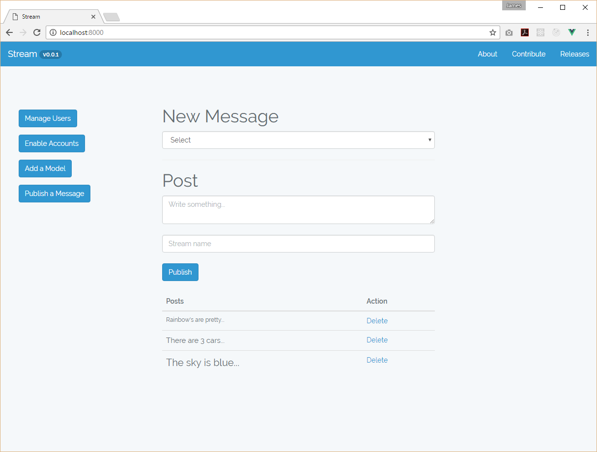
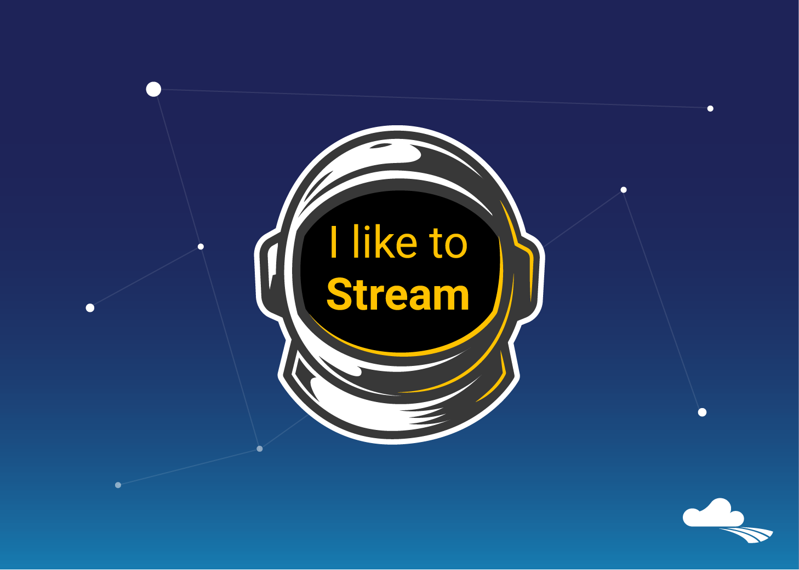

# Overview #
Stream is a Content Publishing Open Source Software under the MIT License. Simply write something and publish to your stream. Stream has been designed to make writing anything fun and easy. Stream is free and simple to customise.

# Requirements #

## Server ##
- PHP 7.0.12
- OpenSSL PHP Extension
- PDO PHP Extension
- Mbstring PHP Extension
- Tokenizer PHP Extension
- XML PHP Extension
- Composer

## Database ##
- MySQL 5.7

## Building (optional) ##
- Laravel 5.3
- VueJS 2.0
- Node/NPM

# Installation - Back-End #
1. Git clone the Stream repository
2. composer install
3. Set up an empty database in MySQL
4. Set up a .env configuration file
5. Run php artisan key:generate
6. Run php artisan serve
7. Run new migration
8. Browse to http://localhost:8000

# Last screenshot... (master) #

## Looking for our legacy code? ##
[git clone -b legacy-code --single-branch https://github.com/puffstream/stream.git](https://github.com/puffstream/stream/tree/legacy-code)

### What happened to the previous code? ###
What's that quote? 1 step back, 2 steps forward? That's the one. Before I can really charge ahead with the Stream Software, I need to have a clear understanding of what Stream is, what it isn't. For example, Stream isn't a News feed. I think that's one of the main issues with the legacy code was that it was still conforming to a News feed where the context of Stream is set apart from this. If your interested in the Stream topic, feel free to follow me on my [Blog](https://streamwebcontent.wordpress.com/).

In the mean-time I have started the next version of Stream, built with Laravel 5.3, VueJS 2, MySQL 5.7 and using JSON Type.

#### Most recent activities (29/03/17)
* Reviewing Laravel Lumen (API version)
* Reviewing React as another JavaScript Library option
* Considering a use-case for Stream, potentially something to do with... UX?
* Quote of the day: Do one thing really well and do it over and over again...

#### Better Developer set-up (DX) (5/04/17)
* Vagrant, Laravel's Homestead, Virtual box etc..

#### MariaDB (SQL, noSQL) (9/04/17)
* Working inside of Homestead box

While you wait... Meet Paul, Our Spaceman.

# MIT License #
MIT is open-sourced software licensed under the [MIT license](https://opensource.org/licenses/MIT).

# Contribute #
Contributions welcome
