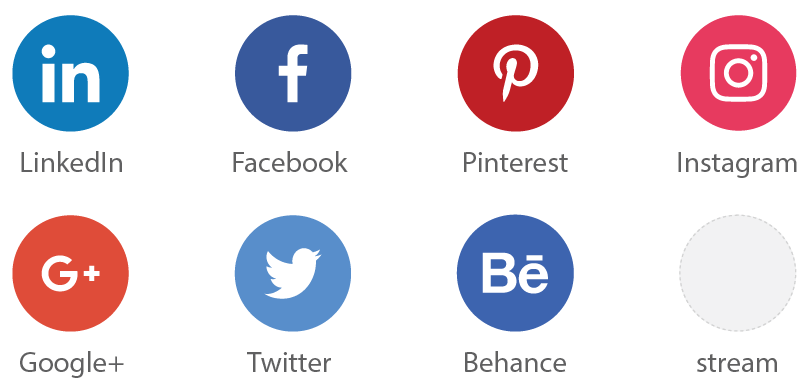

---

# Notice #

This library will be retiring shortly. Thank you for all contributions to the stream project.

---

# Stream. Curating your streams #

> With Stream you can create and collaborate in moments.

Stream helps you to create - build - and collaborate across streams of content. Create your first stream or many streams, build them up, or dispose of them when you need to.

Stream is a great way to manage large amounts of content and channels, from Social Networks, to blogs and websites. Stream is set to challenge the norm.

"Just say stream..."

# Checklist #

If you would like to help out, contact me @puffstream, alternatively send me a PR. 

- [x] Set-up React / Lumen / Vagrant
- [ ] Authentication
- [ ] Filter by keyword
- [ ] Initial migration/seeding
- [ ] Streams - create / list / destroy
- [ ] Posts - create / list / destroy
- [ ] Posts - like / share

# Requirements #

## Server ##
- PHP 5.6
- OpenSSL PHP Extension
- PDO PHP Extension
- Mbstring PHP Extension
- Tokenizer PHP Extension
- XML PHP Extension

## Database ##
- MySQL/MariaDB

## Libs/Frameworks/Tools ##
- Laravel Lumen
- React
- Node/NPM
- Composer

## DX (Developer Experience) set-up ##
- Set up Vagrant, VirtualBox and Homestead box

# Installation - Front-End #
1. Git clone the Stream repository
2. npm install

# Installation - Back-End #
1. cd api/ composer install
2. Set up a .env configuration file
3. Run php artisan key:generate
4. vagrant up
5. vagrant SSH run migration
6. Browse to http://192.168.10.10

## Looking for our legacy code? ##
[git clone -b legacy-code --single-branch https://github.com/puffstream/stream.git](https://github.com/puffstream/stream/tree/legacy-code)

### What happened to the previous code? ###
What's that quote? 1 step back, 2 steps forward? That's the one. Before I can really charge ahead with the Stream Software, I need to have a clear understanding of what Stream is, what it isn't. For example, Stream isn't a News feed. I think that's one of the main issues with the legacy code was that it was still conforming to a News feed where the context of Stream is set apart from this. If your interested in Stream, feel free to follow the [Stream Docs](https://puffstream.atlassian.net/wiki/spaces/STREAM/overview).

Or, optionally read the below updates:

#### Most recent activities (29/03/17)
* Reviewing Laravel Lumen (API version)
* Reviewing React as another JavaScript Library option
* Considering a use-case for Stream, potentially something to do with... UX?
* Quote of the day: Do one thing really well and do it over and over again...

#### Better Developer set-up (DX) (5/04/17)
* Vagrant, Laravel's Homestead, Virtual box etc..

#### MariaDB (SQL, noSQL) (9/04/17)
* Working inside of Homestead box

While you wait... Meet Paul, Our Spaceman.

# MIT License #
MIT is open-sourced software licensed under the [MIT license](https://opensource.org/licenses/MIT).

# Contribute #
Contributions welcome
